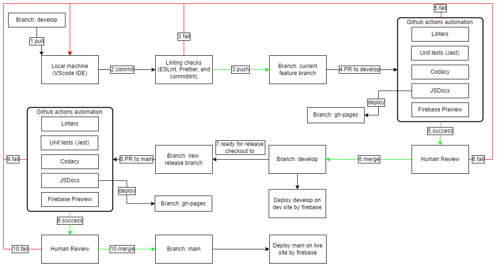

# CI/CD Pipeline Phase 2

## Phase 2 Diagram

## What is Currently Functional
We have the following elements currently functional in our pipeline:

- Linting/Formatting
  - Using ESLint and Prettier
- Automated Unit Tests
  - Using Jest
- Automated Document Generation
  - Using JSDocs
- Code Quality via Tool
  - Using Codacy
- Code Quality via Human Review
  - Justin will review the PR before allowing it to merge
- Web app preview
  - Using Firebase

1. Our pipeline starts from each person's IDEs
  - We install ESLint and Prettier to check each commit
    - If its an automatic fix or nothing is wrong, the individual will be able to commit. However, if something is wrong that ESLint nor Prettier cannot fix, it will error out, not allowing the user to commit.
  - Commitlint to make sure each commit message follows the agreed upon guidelines

2. Next, when a feature/bug is finished and the branch is merged with the latest version of our develop branch, a PR is made from the feature/bug branch into develop. Here is where the following github action jobs are run:
  - Linting/Formatting
    - Using ESLint and Prettier
  - Automated Unit Tests
    - Using Jest
  - Automated Document Generation
    - Using JSDocs
  - Preview of our web app
    - Using Firebase

3. On top of the workflows, we also signed up and integrated our repo with Codacy. Thus, on each pull request Codacy will do the following and show up as one of the checks that are needed before the branch can merge:
  - Codacy Static Code Analysis

4. Finally, if all the checks have passed, Justin will review the PR and see if there are changes that need to be made before the branch can be merged.
  - If there are no changes, then the PR will be merged to the 'develop' branch
  - If not, then the people who made the PR will go back, fix the changes, push them back to the branch, which would then re-start the checks/process in the PR

5. After several features/bugs have been implemented/fixed (usually at the end of each sprint), there will be a release version of our app. This means that we will then merge our 'develop' branch into our 'main' branch (our 'main' branch has our production code/web app)
  - Before 'develop' can be merged into 'main', the same checks as before have to pass, as well as the human review

## What is Planned

In order to produce code that is less error-prone and more production ready, we have the following checks planned for our pipeline:

**HTML Validator**

To implement HTML validation, we are planning to use [HTML5 Validator](https://github.com/svenkreiss/html5validator) and add the github actions job into our develop and main branch PR workflows.

**Code Minification**

To implement code minification, we are planning to use [Auto Minify](https://github.com/marketplace/actions/auto-minify) and add the github actions job into our develop and main branch PR workflows.

**E2E Testing**

For end to end testing, we are planning to use Jest + Puppeteer (as shown in Lab 8) and add the tests we create to our tests directory.
