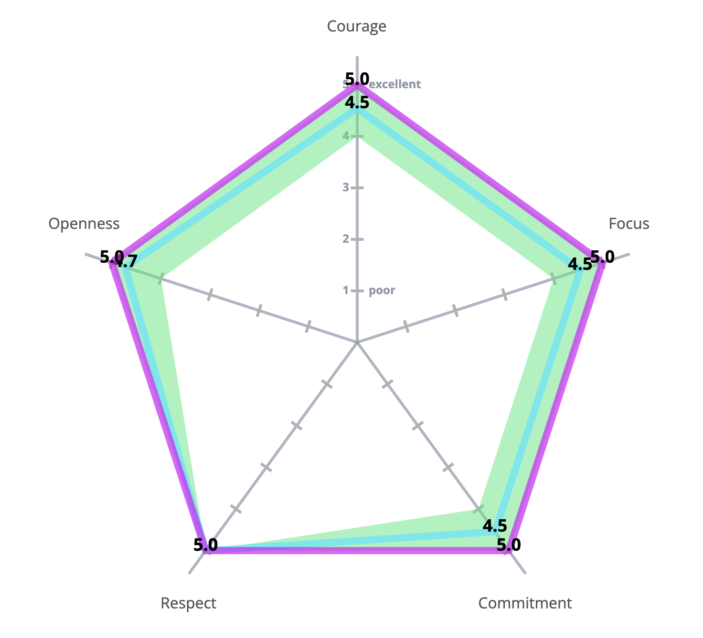
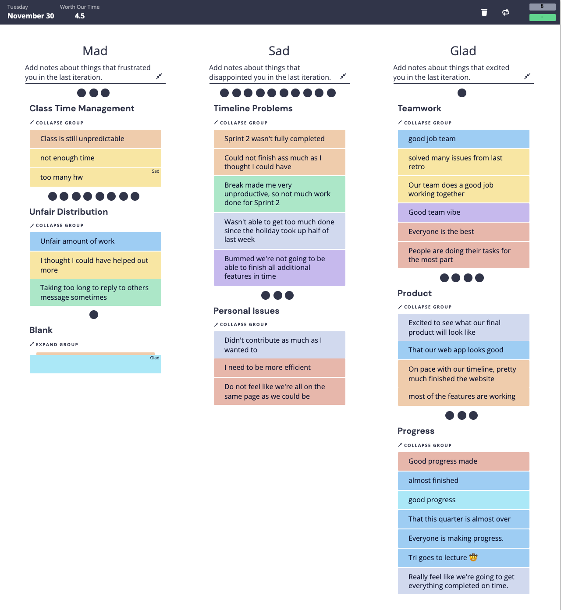
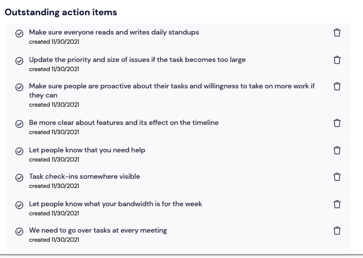

# Team Meeting Minutes
Team Name/Number: Red Pandas/29  
Date: November 30, 2021  
Time: 1:30pm  
Location: Biomedical Library 204

## Attendance

### Present
- Tri
- Edbert
- Avery
- Baha (Zoom)
- Enzo
- Fangcheng
- Haonan
- Jeffrey (Zoom)
- Justin
- Viki
- Zhuoran

### Absent
Everyone was in attendance.

## Purpose of Meeting
Complete the 2nd Retrospective Assignment

## Decisions Made

N/A

## Agenda and Meeting Notes

### Scrum Values

### Mad, Sad, Glad

### Action Plan
