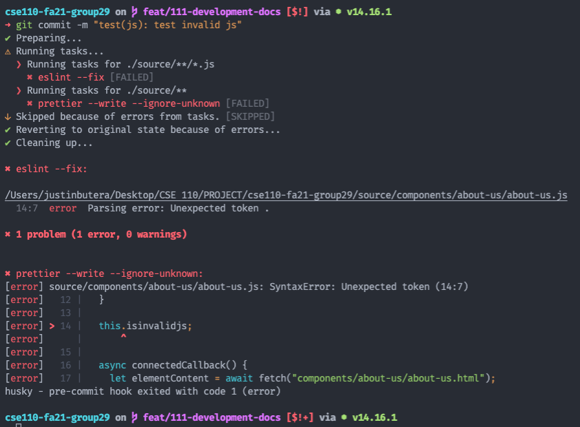
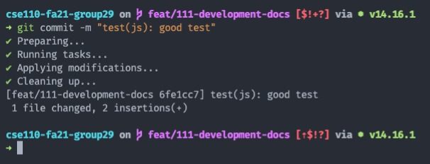

# CSE 110 - Red Pandas - Local Environment Setup

[Back to Table of Contents](README.md)

## Overview
This document covers the necessary requirements to get your local environment up and running.

### Topics discussed
1. Git setup
2. Linter & commitlint setup (`eslint`, `prettier`, and `commitlint`)
3. How to fix errors from the linters & commitlint
4. How to bypass linters & commitlint (ONLY IF NECESSARY)

## Git setup
Please run the following command to ensure that your `git pull develop` commands do not create weird merge commits:
```shell
# Set 'git pull' to only fast forward. This ensures we do
# not make any developmental changes to the 'develop' branch.
# Only run this command once.
git config pull.ff only
```

## Linter & commitlint setup
NOTE: Please ensure you had `npm` installed. If you do not, please install it.

NOTE 2: By setting up the linters and commitlint, whenever you _commit_ (run `git commit`), `eslint` (JS linter) and `prettier` (HTML/CSS/JS formatter) will **automatically** run on your machine and format your code. Then `commitlint` will ensure that you formatted your commit correctly.

Please run the following commands to ensure that your npm setup and linter setup is correct:
```shell
# Install all required packages from 'package.json'.
npm install

# Install git pre-commit hook to run linters.
npx husky install
```

## How to fix linter & commitlint errors
1. If `eslint`, `prettier`, or `commitlint` fail, your commit will NOT be "committed".
2. Instead, you need to either fix the errors (please do this) or bypass (please _don't_ do this unless you have to).
3. To fix `eslint` or `prettier` errors, you will see a similar message to the below screenshot when attempting to commit:
  
4. In this case, both `eslint` and `prettier` failed.
   1. The `eslint` error is first, and it says there's a "Parsing error: Unexpected token ." on line 14 of `about-us.js`.
   2. The `prettier` error is next, and it also says there's a "SyntaxError: Unexpected token" on line 14 of `about-us.js`. Prettier also gives a snippet of the code in that area as well.
5. Here's what it looks like if it worked correctly:
  
6. To fix `commitlint` errors, you need to modify your commit message to follow our standard, then try again. You'll know it worked because it was successfully committed to your branch.
7. If it errors out, here's an example of what you'll see:
  

## Bypassing linters & commitlint
1. If in the event of an emergency and you NEED to get the commit onto GitHub, please run the following command:
  ```shell
  git commit --no-verify
  ```
2. This will ignore all commit hooks (including `eslint`, `prettier`, and `commitlint`), and let you commit.
3. Please please _please_ use this very sparingly. The entire point of these linters is to make sure standards are followed, so bypassing it ruins the point.